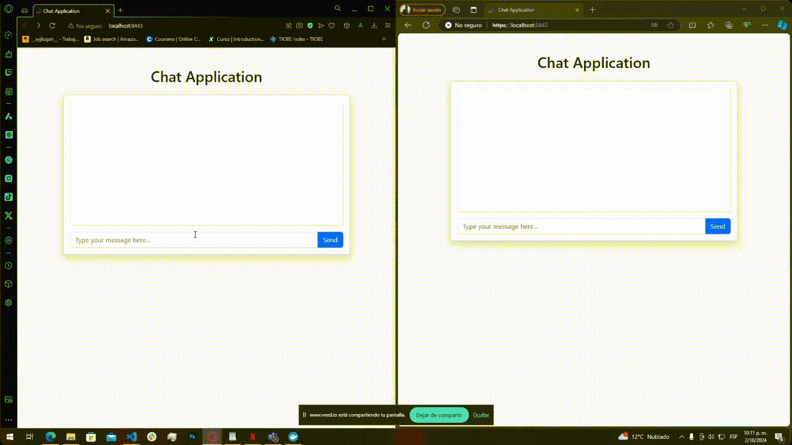
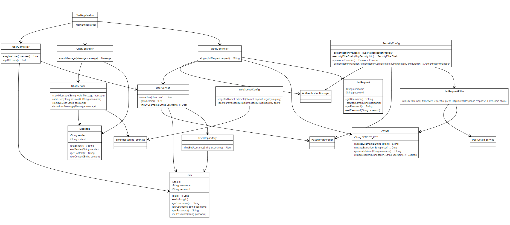

# Chat Application

## Description

This is a Spring Boot-based chat application that uses WebSockets for real-time messaging. The application includes authentication via JWT (JSON Web Token), user management with Spring Data JPA, and real-time chat using STOMP over WebSockets. MySQL is used as the database for storing user information, and Docker can be used to easily set up the database environment.

## Features

- **Real-time chat** using WebSockets and STOMP
- **JWT-based authentication** for secure login
- **Spring Data JPA** for managing user data with MySQL
- **REST API** for user registration and login
- **MySQL** integration for persistent storage
- **Docker** for easy database setup

## Prerequisites

To run this project, you need to have the following installed:

- [Java 17](https://www.oracle.com/java/technologies/javase-jdk17-downloads.html)
- [Maven](https://maven.apache.org/install.html)
- [Docker](https://www.docker.com/get-started) (for setting up MySQL)

## Setup Instructions

### 1. Clone the repository

```bash
git clone https://github.com/JohannBulls/Chat-Application.git
cd Chat-Application
```

### 2. Configure MySQL Database

You can set up a MySQL instance easily using Docker. The following command will pull the latest MySQL image and start a MySQL container named `mysql-chatdb`.

```bash
docker run --name mysql-chatdb -e MYSQL_ROOT_PASSWORD=secret -e MYSQL_DATABASE=chatdb -p 3307:3306 -d mysql:latest
```

This command does the following:

- Creates a new MySQL container named `mysql-chatdb`
- Sets the root password to `secret`
- Creates a database named `chatdb`
- Exposes MySQL on port `3306`

### 3. Update the `application.properties`

In the `src/main/resources/application.properties` file, make sure the MySQL configuration matches the Docker setup:

```properties
spring.datasource.url=jdbc:mysql://localhost:3306/chatdb
spring.datasource.username=root
spring.datasource.password=secret
spring.datasource.driver-class-name=com.mysql.cj.jdbc.Driver
spring.jpa.hibernate.ddl-auto=update
spring.jpa.show-sql=true
```

### 4. Build and run the application

Once you've configured MySQL, you can build and run the application using Maven:

```bash
mvn clean install
mvn spring-boot:run
```


### 5. Access the Application

After the application starts, you can access it via:

- **Real-time chat**: `https://localhost:8443`

Make sure the application is running with SSL on port 8443, as configured in `application.properties`.

### 6. Running Unit Tests

To run the unit tests for the project, use the following Maven command:

```bash
mvn test
```

This will execute all the unit tests, including those for authentication, user management, and the chat functionality.

## API Endpoints

### User Registration

- **URL**: `/users/register`
- **Method**: POST
- **Body**:
    ```json
    {
      "username": "user123",
      "password": "password123"
    }
    ```

- **Response**:
    ```json
    {
      "id": 1,
      "username": "user123"
    }
    ```

### Login

- **URL**: `/auth/login`
- **Method**: POST
- **Body**:
    ```json
    {
      "username": "user123",
      "password": "password123"
    }
    ```

- **Response**:
    ```json
    {
      "token": "your.jwt.token.here"
    }
    ```

### WebSocket Connection

- **WebSocket Endpoint**: `/chat-websocket`
- **Message Destination**: `/app/chat`
- **Message Broadcast**: `/topic/messages`

Messages are sent to the `/app/chat` endpoint, and broadcast to all clients subscribed to `/topic/messages`.

## Docker Commands

Here are some useful Docker commands to manage your MySQL container:

- **Start the MySQL container**:
  ```bash
  docker start mysql-chatdb
  ```

- **Stop the MySQL container**:
  ```bash
  docker stop mysql-chatdb
  ```

- **View logs from the MySQL container**:
  ```bash
  docker logs mysql-chatdb
  ```

## Project Structure

[](https://www.mermaidchart.com/raw/943cdc6b-d011-4bd7-9763-476c05c0be2c?theme=light&version=v0.1&format=svg)

## License

This project is licensed under the MIT License - see the [LICENSE](LICENSE) file for details.